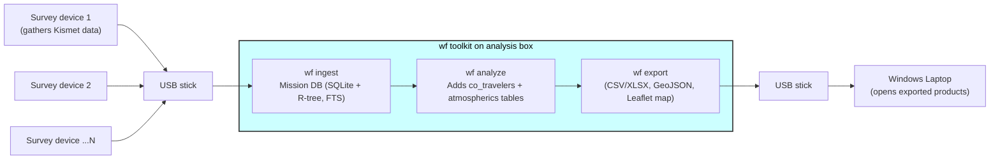

# Wi‑Fi Forensics (wf) – Project Specification

---

## 0. Purpose

Provide operators with an **offline analysis toolkit** that ingests Wi-Fi survey logs, detects co‑travelling and stationary devices, computes "atmospherics", and exports portable products (CSV/XLSX, GeoJSON, offline Leaflet map) for exploitation on Windows machines.

This toolkit is intended to **run on a Raspberry Pi 5 analysis box** equipped with a 26 TOPS Edge‑TPU hat.

---

## 1. High‑Level Requirements

| ID | Requirement |
|----|-------------|
| R‑1 | Run entirely on a Raspberry Pi 5 (16 GB) with 26 TOPS TPU hat, air‑gapped. |
| R‑2 | Accept multiple raw capture files from multiple collectors without manual sorting. |
| R-3 | Accept operator-friendly inputs: simple options, commonly used units. |
| R‑4 | Produce operator‑friendly outputs: an interactive HTML map. |
| R‑5 | Detect co‑travellers via explainable, deterministic spatiotemporal clustering. |
| R‑6 | Provide fast “atmospherics” summaries (AP counts, encryption stats, busiest APs, etc.). |
| R‑7 | Zero GUI dependency for processing; CLI only (TUI optional future). |
| R‑8 | Single‑file, offline installer; no network access during install or runtime. |

---

## 2. Reference Architecture



All analytics run locally; original raw files remain immutable for chain‑of‑custody.

There must be a single SQLite database per mission. Specifying a mission name is synonymous with specifying white SQLite database. Each mission/database may have multiple observation sessions contained in it.

---

## 3. Repository Layout

```
wf/                      # Python package root
 ├─ parsers/             # kismet.py, airodump.py
 ├─ storage/             # schema.sql, db.py, dao.py, constants.py
 ├─ analysis/
 │    ├─ path.py         # Reconstruct the driven mission path and time from all logs
 │    ├─ classifier.py   # Logic for classifying devices as co-travellers, static, etc
 │    └─ atmos.py        # Atmospherics via SQL
 ├─ export/
 │    ├─ csv.py
 │    ├─ geojson.py
 ├─ utils/
 │    ├─ config.py       # TOML loader
 │    ├─ validate.py     # Pydantic schemas
 │    └─ log.py          # Rich logging
 ├─ tests/               # PyTest suites
 ├─ webapp/              # static front-end
 │    ├─ index.html
 │    ├─ app.js          # Leaflet + Chart.js; handles UI & Ajax
 │    └─ style.css
 ├─ server.py            # FastAPI app + SQL helpers
 └─ cli.py               # Exposes `wf` command
```

* No `interfaces/`; GUI/TUI postponed.

### Naming Conventions

* **Files/dirs:** `snake_case`  
* **Classes:** `PascalCase`  
* **Functions & vars:** `snake_case`  
* **CLI commands:** `wf <verb>`  

---

## 4. CLI Workflow

```
wf ingest <path> [--mission <name>]
wf analyze <db_path> [--from ISO8601 --to ISO8601]
wf export --all <db_path> [--outdir <dir>]
```

* **Ingest** recursively finds `.kismet` and `.csv`, hashes files and skips duplicates, calls respective parsers per file type, merges into `/data/processed/<mission>/wf_<mission>.sqlite`.  
* **Analyze** populates derived tables.  
* **Export** is mostly optional, it's a thin wrapper around what serve does for the whenever things must be handed off rather than "open my browser". It'll just reuse the same SQL behind the API endpoints. 
  - `co_travelers.csv` & `atmospherics.csv`  
  - `all_data.geojson`  
* **Serve** spins up Uvicorn and automatically opens the default browser to http://localhost:8000.

Default directory tree (configurable via `wf.toml`):

```
/data/
 ├─ input/<mission>/{raw/}
 ├─ processed/<mission>/wf_<mission>.sqlite
 └─ exports/<mission>/{*.csv, *.xlsx, *.geojson, map/}
```

## 5. Key Modules in Detail

### 5.1 `parsers/`
| File | Responsibility |
|------|----------------|
| `kismet.py` | Connect to `.kismet` (SQLite) ➜ SELECT required columns from `devices`, `packets`, etc.; unpack `devices.device` as a json to get more clumns; yield normalized `Record`. |
| `airodump.py` | Parse CSV lines ➜ same normalized `Record`. |

`Record` fields: `session_id, mac, ssid, frequency, channel, ts_epoch_ms, lat, lon, rssi_dbm, enc_type, device_type, source_node`.

### 5.2 `storage/`
* `schema.sql` – Creates tables:

| Table | Purpose | Key Columns / Indexes |
|-------|---------|-----------------------|
| `sessions` | One per raw file | sessions(id, mission TEXT, src_file TEXT, sha256 TEXT, start_ts, end_ts) |
| `devices` | One row per MAC/BSSID | devices(mac (PK), type TEXT, first_ts, last_ts, oui_manuf, encryption, is_randomized, ssid, )
| `observations` | Probe/AP sightings | observations(id, mac, session_id, ts, lat REAL, lon REAL, rssi, channel) |
| `device_locations` | GPS fixes | `mac`, `ts`, `lat`, `lon` **R‑tree(lat, lon)** |
| **R-tree index** | R‑tree index on (lat, lon) | CREATE VIRTUAL TABLE obs_rtree USING rtree(id, min_lat, min_lon, max_lat, max_lon); |
| **FTS5 index** | Full‑text search for fast MAC/SSID lookup| CREATE VIRTUAL TABLE device_fts USING fts5(mac, manuf, ssid); |
| **Derived** | Filled by `wf analyze` | `co_travelers`, `stats_*` |

All timestamps are stored in **UTC seconds**. Latitude/longitude in WGS‑84.

### 5.3 `analysis/`

#### 5.3.1 `classifier.py`

* **Inputs:**  
  * `observations` table (raw per-packet Wi-Fi frames)  
* **Outputs:**  
  * `static_ap` table – one row per stationary transmitter (APs, IoT)  
  * `mobile_track` table – decimated GPS polyline per moving transmitter  
* **Intermediate Tables:** retain in-memory, only write the final tables out.

**Configurable Constants**
Stored in **`pipeline_cfg`**, tunable at runtime by passing a flag like --mode driving or --mode walking, which will have appropriate presets.

| Constant | Default | Units | Role |
|---|---|---|---|
| T_MAX_GAP       | 120 | seconds | end visibility window if silent ≥ this gap   |
| MIN_WINDOW_LEN  | 1   | packets | ignore ultra-short windows                   |
| R_STATIONARY    | 350 | metres  | max diameter to qualify as “stationary”      |
| MOBILE_DECIM_D  | 100 | metres  | distance threshold for keeping mobile points |
| MOBILE_DECIM_T  | 30  | seconds | time threshold for keeping mobile points     |

##### Algorithm - Processing Passes

###### Pass 0 – Normalisation

* **Input:** `observations`  
* **Output:** `obs_norm`  
* **Actions:**  
  1. Drop rows with `lat` OR `lon` IS NULL  
  2. Deduplicate on `(mac, ts, lat, lon)`  
* **Index:** `idx_norm_mac_time(mac, ts)`

###### Pass 1 – Visibility Windowing

* **Output:** `win(mac, ts_start, ts_end, pkt_count)`  
* **Logic:** split per-MAC timeline when gap ≥ `T_MAX_GAP` using `LAG(ts)`  
* **Index:** `idx_win_mac(mac)`

###### Pass 2 – Stationary vs. Mobile Classification

* **Outputs:**  
  * `win_stat` (windows with `d_max ≤ R_STATIONARY`)  
  * `win_mob`  (windows with `d_max > R_STATIONARY`)  
* **Computation:**  
  1. For each window, fetch all points (`ts BETWEEN ts_start AND ts_end`)  
  2. Compute `d_max = ST_MaxDistance(points)` (Haversine/PostGIS)  
* **Indexes:** `idx_stat_mac(mac)`, `idx_mob_mac(mac)`

###### Pass 3A – Static AP Aggregation

* **Output:** `static_ap`  
* **Steps per `mac`:**  
  1. Cluster `win_stat` centroids via DBSCAN (`eps = R_STATIONARY`)  
  2. For each cluster compute:  
     * `lat_mean`, `lon_mean` (RSSI-weighted)  
     * `loc_error_m` = ½ max pairwise distance  
     * `first_seen`, `last_seen`, `n_obs` aggregates  
* **Primary Key:** `mac`

###### Pass 3B – Mobile Raw Track

* **Output:** `mobile_raw_track(mac, ts, lat, lon)`  
* **Action:** concatenate all `win_mob` points ordered by `ts`

###### Pass 4 – Track Decimation

* **Input:** `mobile_raw_track`  
* **Output:** `mobile_track(mac, ts, lat, lon)`  
* **Algorithm per `mac`:**  
  1. Seed with first point  
  2. Keep a point if ≥ `MOBILE_DECIM_D` from last kept OR ≥ `MOBILE_DECIM_T` elapsed  
  3. Discard tracks with < 2 points  
* **Index:** `idx_mt_mac_time(mac, ts)`

###### Pass 5 – QA & House-keeping

* Examples:  
  * Flag `static_ap` where `loc_error_m > R_STATIONARY`  
  * Drop `mobile_track` segments implying speed > 200 km/h  

## 6. Deliverables & API Contract  

| Table | Columns | Description |
|---|---|---|
| `static_ap` | `mac`, `lat_mean`, `lon_mean`, `loc_error_m`, `first_seen`, `last_seen`, `n_obs` | one physical location per stationary radio |
| `mobile_track` | `mac`, `ts_s`, `lat`, `lon` | decimated, time-ordered polyline of each moving radio  |

#### 5.3.2 `atmos.py`

Implement fetchers that will provide all the data referenced in Section 5.6.5 Atmospherics pane

Pure SQL aggregations along the lines of: 
`SELECT encryption, COUNT(*) … GROUP BY encryption;`  
`SELECT mac, COUNT(*) … ORDER BY COUNT DESC LIMIT 50;`

### 5.4 `export/`
* `csv.py` – One CSV per view, optional `--xlsx` merges into one workbook via `xlsxwriter`.
* `geojson.py` – Device tracks and AP points ➜ `devices.geojson`, `tracks.geojson`.

### 5.5 `utils/`
* `config.py` – Project‑wide config in `/etc/wf.toml` or `$HOME/.config/wf.toml` (paths, clustering params) or project-level `input/<mission>/wf.toml`
* `validate.py` – Pydantic models to sanity‑check parser outputs.
* `log.py` – Unified structured logging; `wf ingest` writes `/ingest.log`.

### 5.6 `webapp`

#### 5.6.1 High level UX goals

1. Immediate situational awareness: Default view opens at mission bounding box
2. De‑clutter high‑density scenes: Progressive clustering & heat‑map modes tied to zoom.
3. Explain mobility: Animated or static trajectory lines with clear start/end glyphs and time slider.
4. Quick filtering: Left‑hand “layer switcher + filter drawer” (mobile friendly).
5. Data provenance: Pop‑ups link back to session ID, first/last seen, random‑MAC flag.
6. Zero learning curve: Every control mirrors paradigms from Google Maps / QGIS.

#### 5.6.2 UI Design

1. Single HTML page opened locally (no network) in the operator’s browser.
2. Left drawer with two equal-sized panes in a split view:
    * Left pane controls all lauers, filters, and toggles
    * Left ≙ Leaflet map.
    * Right ≙ “Atmospherics” dashboard (tables + simple charts via Chart.js).
3. Global bar across the top:
    * Name of the mission
4. Any change in the filter bar fires one Ajax request that refreshes BOTH panes.
5. Static APs are visualized as circles
6. Mobile tracks are visualized as polylines with start/end glyphs

#### 5.6.3 Map Layers Architecture

| Layer (toggle) | Default Visible | Rendering Tech | Notes |
|---|---|---|---|
| Clustered APs | ✔ | L.MarkerCluster (or SuperCluster tiles) | Expands to individual AP icons at ≥ z15.
| Heat‑map (AP density) | — | Leaflet.heat canvas layer | Mutually exclusive with clusters – acts as density overlay. |
| Mobile tracks with start/end gylphs | ✔ | L.Polyline + Canvas renderer and L.CircleMarker / SVG arrowhead | One color per co‑traveller group, start = hollow green, end = solid red. | 

#### 5.6.4 Interaction Design

##### 5.6.4.1 Control strip (left drawer)

* Layer toggles: check boxes for each layer above
* Filter chips: Device type, encryption type, randomized, OUI
* Search box: MAC/SSID substring -> instant highlight and pan
* “From / To” datetime pickers and dual handle noUiSlider start/end timeslider so that you can use either calendar or slider (defaults = full span of mission start time, end time).
* “Draw selection” button → lets the user drag a rectangle, polygon, or lasso on the map to execute a selected-area query, using leaflet.draw into post-filter JS
* “Clear filters” button.

##### 5.6.4.2 Map interactions

* Hover on cluster bubble → tooltip “217 APs (46 open)”.
* Click cluster → zoom & spiderfy.
* Click AP dot → pop‑up card: SSID, vendor, first/last, encryption, RSSI dist chart thumbnail.
* Click track → highlights full line, auto‑opens detail panel with:
  * MAC and SSID
  * Number of observations
  * Earliest seen, last seen

#### 5.6.5 Atmospherics pane

Present the following summary with numbers pulled from the data that is being displayed and filtered:

* 400 unique MACs
* 75 unique SSIDs
* 25 SSIDs with no encryption, 40 SSIDs with WPA2, 10 SSIDs with WPA3
* Top 5 OUI manufacturers: ASUS, Apple, TP Link, Google, Huawei
  * <horizontal bar chart showing relative frequency of those OUIs>
* 200 Access points, only 27 with Clients
* 11 passive handshakes detected
* All local banks use same SSID: muchodinero
* Scan period: 12 days, day (0700-1300) and night (1900-0300)

### 5.7 `cli.py`
Commands:
```
wf ingest <src_dir> [--mission NAME]
wf analyze <db_path> [--from ISO8601] [--to ISO8601] 
wf export <db_path> --all|--cotravel|--stats [--outdir <dir>]
wf serve <db_path> [--port 8000]
wf version
```

---

## 7. Dependencies

| Package | Version Pin | Reason |
|---------|-------------|--------|
| Python | 3.12.* | 3.12 gains performance; shipped in bundle |
| `sqlite3` | latest | db |
| `numpy` | 1.26.* (ARM wheel) | vector ops |
| `pandas` | 3.* | CSV/XLSX handling |
| `orjson` | >=3.10 | fast `.kismet` JSON |
| `hdbscan` | 0.8.* | clustering |
| `py-tflite-runtime` | matching TPU rev | TPU delegate |
| `jinja2` | latest | HTML templating |
| `rich` | latest | pretty CLI and logging |
| `pydantic` | 2.* | data validation |
| `xlsxwriter` | latest | Excel export |
| `shapely` | latest | GIS helpers |
| `pytest` | latest | Testing |
| `coverage` | latest | CI quality gate |
| `makeself` | Packaging for offline install with self‑extracting .run |
| `folium` | latest | Offline map with Leaflet |
fastapi
uvicorn
chart.js

All wheels pre‑built for `linux_aarch64` and bundled.
Edge‑TPU runtime (`libedgetpu1-max`) bundled in installer.

---

## 8. Packaging & CI/CD

### 8.1 Git Layout

```
repo-root/
├─ wf/                        # source tree (above)
├─ ci/
│  ├─ Dockerfile.build        # cross‑build image (arm64)
│  ├─ build_wheels.sh         # pip wheel --platform linux_aarch64
│  ├─ make_run.sh             # packages wheels + source into .run via makeself
│  ├─ default-wf.toml         # default config for `/etc/wf.toml`
│  └─ github.yaml             # github workflows
```

### 8.2 Build Pipeline

1. **lint / test**  
   `pytest -q && coverage run …`
2. **wheelhouse**  
   `ci/build.sh` uses `cibuildwheel` on an ARM64 runner to produce `wheelhouse/*.whl` (no internet wheels allowed).
3. **Installer Creation**  
   `ci/package.sh` embeds:  
   * Minimal CPython 3.12 tarball  
   * Wheelhouse  
   * `wf/` source  
   * Optional `.deb` prerequisites (`libedgetpu1-max`, `libatlas`)  
   * `install.sh` script 
   And outputs `wf_install_vX.Y.Z.run` (makes `/opt/wf`).
4. **release**  
   Attach `*.run` and SHA‑256 to Git tag artifacts.

### 8.3 Air‑Gapped Install

```bash
chmod +x wf_install_vX.Y.Z.run
sudo ./wf_install_vX.Y.Z.run
```

Creates `/opt/wf/` venv and `/usr/local/bin/wf`.
Creates /usr/local/bin/wf symlink

Rollback: switch symlink to prior `/opt/wf‑<ver>`.
Uninstall: remove `/opt/wf` and symlink.

---

## 9. Naming & Coding Conventions

* **Snake_case** for variables & functions, `CamelCase` for classes.
* All module‑level constants in `UPPER_SNAKE`.
* Type‑hints everywhere; `mypy --strict` in CI.
* Docstrings: NumPy style.
* Ten‑character mission IDs `OP_<NAME>` uppercase.
* Session UUID: `uuid4()` stored as TEXT.
* File hashes: SHA‑256 hex string.

---

## 10. Testing

* Unit tests in `tests/` (PyTest, 90 % coverage goal) cover parsers, ETL, algorithms.  
* Sample `.kismet` and CSV fixtures anonymised in `tests/data/`.
* Integration test: run `wf ingest → analyze → export` inside Docker container emulating Pi64.
* `bandit -r wf/` and `ruff` run in CI.

---

## 11. Security

* SHA‑256 for every raw file; stored in DB.  
* No outbound network calls; Leaflet assets local.  
* Logs scrub hostname/user; classification banner configurable.  
* Installer verifies Edge‑TPU firmware checksum before enabling.
